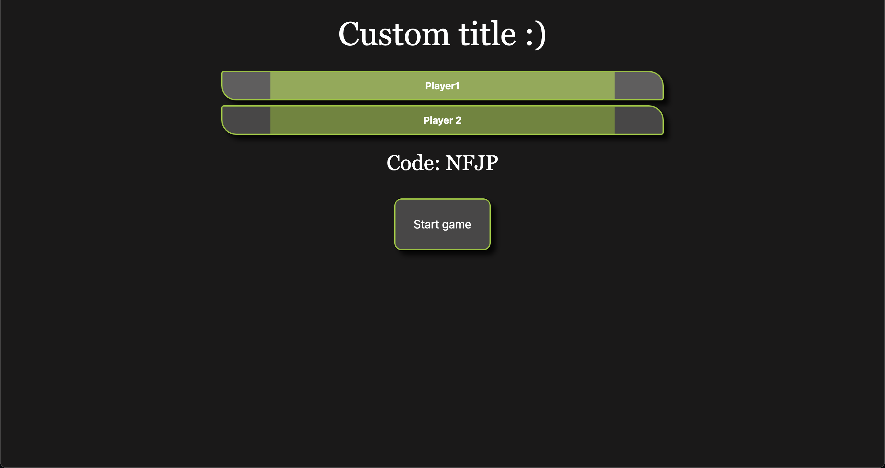
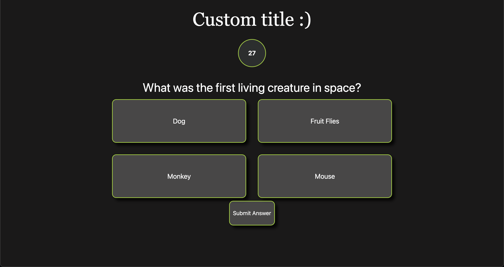
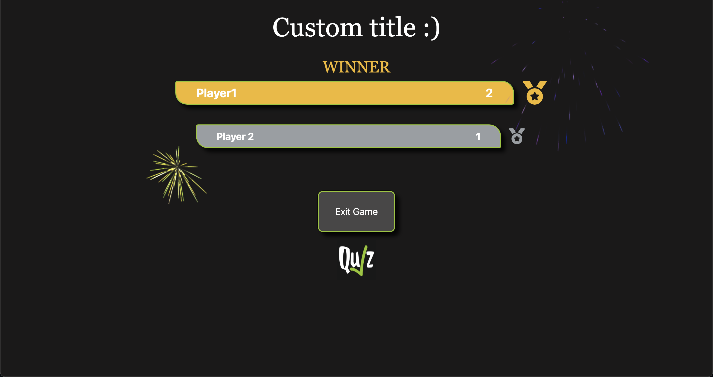

Quiz is a web application that is ideal for having a pub quiz anywhere, anytime.
This site contains a Home page, Rules page and Quiz pages.





## Getting started

1. Clone the repo

```
git clone https://github.com/zarrcode/quiz.git
cd app
```

This repo is half the Quiz application.
Follow the instructions in the quiz-server repo as well.

```
git clone https://github.com/zarrcode/quiz-server.git
```

1. Install dependencies
```
npm install
```

3. Run the app
```
npm run dev
```

## Tech Stack

Next.js / React, Tailwind CSS, SASS